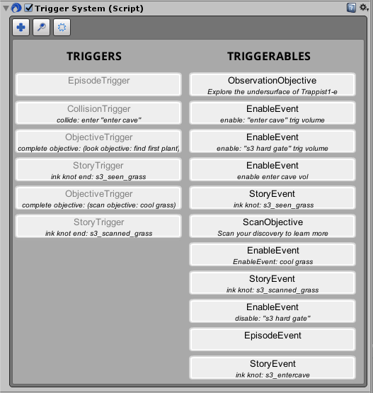

# StratusFramework
In this repository you will find the source code to the Stratus Framework, a C# gameplay scripting framework for facilitating the composition of gameplay code for the Unity Engine.
Its major tenet is to provide useful features with an easy to use interface while removing of as much boilerplate code from your scripts as possible.

I consider this framework very much a work in progress. Even so I find its core features, the Events and Actions systems to be rather robust, and can be used as is. The interface for them won't be changing in the future, as any future work on them will be adding features and fixing any discovered issues.

---
## Features
- **Events**: A custom event system using delegates that greatly simplifies the use of callbacks in code, for the implementation of code using the Observer pattern. Events can be dispatched either to GameObjects directly, or to the whole Scene. Monobehaviours can subscribe to events on either GameObjects or to the scene.
- **Actions**: An Action list library with a very simplified interface for quickly construction action sets for interpolating properties, delayed function invocations, etc.
- **Triggers**: A family of components that are activated on conditions specific to each one. For example a *CollisionTrigger* will activate when it detects a specified type of collision with a specified target. When a trigger component is activated, it will send a *Trigger* event to a specified target by either a direct invocation on a specific method (through *UnityEvent*) or through an event object sent to that GameObject. 
These *Trigger* events are received by additional family of components called *EventDispatchers* which upon receiving them, perform some generic functionality, such as transforming an object, changing the scene, etc. By using both these families together the possibility space for what you can do without having to write boilerplate code is very high! 
- **Routines**: A lightweight API for managing coroutines as well as a small library of common  functions which could easily be reused throughout a codebase.
- **Trace**: A small library that decorates logging calls appropriately for quickly logging methods, member variables, etc.
- **Extensions**: A few extension methods which I found missing from the main classes we regularly interface with in Unity, such as GameObject and Monobehaviour.

---
## Features:

Here are some of the main features within the framework. I have provided sample scripts to display the functionality in the samples folder. To test them just add them to a component in Unity and read the console's output to inspect the sequence of calls. Some snippets of the code within:

#### Events

```C#

  public class SampleEvent : Stratus.Event 
  {
    public int Number;
  }

  public void OnSampleEvent(SampleEvent eventObj)
  {
    Trace.Script("Event received!", this);
    Trace.Script("Number = " + eventObj.Number, this);
  }
  
  public void DispatchEvent() 
  {
    // Connect a member function to the given event
    this.gameObject.Connect<SampleEvent>(OnSampleEvent);
    // Construct the event object
    SampleEvent eventObj = new SampleEvent();
    eventObj.Number = 5;
    // Dispatch the event to the gameobject
    Trace.Script("Event dispatched", this);
    this.gameObject.Dispatch<SampleEvent>(eventObj);
  }    
```

#### Actions

```C#

    public float SampleFloat = 5;

    void ConstructActionSequence() 
    {
      // Construct the action sequence, adding it onto this GameObject's list of active actions
      var seq = Actions.Sequence(this);
      // First action we will create is a delay, which is a *blocking* action
      Actions.Delay(seq, 2.0f);      
      // Second, we will interpolate the value of the field 'SampleFloat' from its initial value (5) 
      // to a specified value (25) over 2 seconds using a specified easing (curve) algorithm
      Actions.Property(seq, ()=>this.SampleFloat, 25, 2.0f, Ease.Linear);
      // Third and last, we will invoke a specified function!
      Actions.Call(seq, this.Boop);
      Actions.Call(seq, ()=>this.Boop(7));
	  Actions.Call(seq, ()=> { Trace.Script("Boop!"); });

    }
    
    void Boop() 
    {
      Trace.Script("Boop!");
    }
    
    void Boop(int times) 
    {
      Trace.Script("You booped " + times + " times", this);
    }
    

```

#### Trigger System

The Trigger System was designed to compose gameplay events by linking triggers and actions in a generic way, by roughly classifying them inside two component families:

Triggers: Components which react to specific events which change the state of the game, such as collisions, timers, input, etc. For example a CollisionTrigger will react to the collisions event of a target object, and will in turn activate a given triggerable (or many).
Triggerables: Components that when triggered, change the state of the world in some way. For example the TransformEvent will affect the transform of an object, such as providing translation, rotation or scaling.




---
## Download

I have provided the Unity package for importing the framework into your Unity project <a href=https://github.com/Azurelol/Binaries/blob/master/StratusFramework.unitypackage>here</a>

---
## Contact

If you discover any bugs or have any and all constructive feedback on how to improve the framework, feel free to contact me.